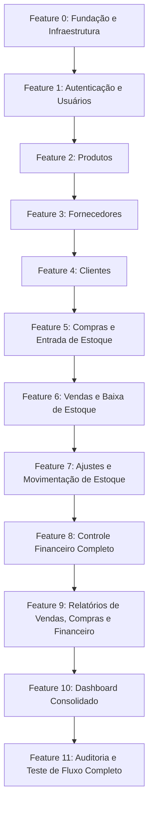

# Plano de Implementação — Sistema Uniqprint (Controle de Compras e Vendas)

## 1. Análise Completa das Fontes de Verdade

Com base na leitura rigorosa de `plan.md`, `.agents/skills/arquitetura/skill.md`, `.agents/skills/back-end/skill.md`, `.agents/skills/front-end/skill.md` e `.agents/rules/arquitetura.md`, apresentamos a análise preliminar:

---

### 1.1 Requisitos
* **Objetivo Geral**: Desenvolver um sistema web (MVP) simples, robusto e seguro para controle de produtos, fornecedores, clientes, compras (entradas), vendas (saídas), estoque em tempo real, financeiro (entradas/saídas) e relatórios operacionais.
* **Preparação Arquitetural Futura**: Preparar módulos desacoplados para futura importação de notas fiscais via XML (`modulos/notas_fiscais`) e consumo das mesmas regras de negócio por aplicativo Android via API REST.
* **Módulos Principais do MVP**:
  1. Autenticação e Gestão de Usuários (ADMINISTRADOR e USUARIO);
  2. Cadastro de Produtos (com controle de estoque e inativação lógica);
  3. Cadastro de Fornecedores (com inativação lógica e preservação de histórico);
  4. Cadastro de Clientes (com inativação lógica e histórico);
  5. Registro de Compras (transação atômica: registro de compra + entrada em estoque + movimentação de estoque + saída financeira);
  6. Registro de Vendas (transação atômica: validação de estoque suficiente + registro de venda + baixa de estoque + movimentação de estoque + entrada financeira);
  7. Controle e Auditoria de Estoque (movimentações `ENTRADA`, `SAIDA`, `AJUSTE`, prevenção absoluta de estoque negativo);
  8. Controle Financeiro (lançamentos manuais e automáticos de `ENTRADA` e `SAIDA`, categorias, cálculo de saldo);
  9. Relatórios (Vendas, Compras e Financeiro por semana, mês ou período customizado com filtros no banco);
  10. Dashboard consolidado (resumo de vendas, compras, saldo, alertas de estoque baixo e últimas operações);
  11. Auditoria de operações críticas (`registros_auditoria`).

---

### 1.2 Arquitetura
* **Desenvolvimento Vertical por Feature**: Nenhuma funcionalidade de negócio é considerada concluída apenas no back-end. Cada feature implementa:
  - Banco de Dados (modelos Prisma e migrations);
  - Back-end (rotas Fastify, controladores, serviços/casos de uso, repositórios, validação Zod);
  - Front-end (tipos TypeScript, serviços de API, formulários, componentes, páginas, tratamento de erros, feedbacks de carregamento);
  - Testes Automatizados (unitários e de integração de ambos os lados).
* **Camadas do Back-end**:
  $$\text{Rota Fastify} \longrightarrow \text{Controlador} \longrightarrow \text{Serviço / Caso de Uso} \longrightarrow \text{Repositório} \longrightarrow \text{Prisma ORM} \longrightarrow \text{MySQL/MariaDB}$$
* **Front-end**:
  $$\text{Página/Componente} \longrightarrow \text{Hook/Estado} \longrightarrow \text{Serviço de API} \longrightarrow \text{Backend REST}$$
* **Desacoplamento Total**: O back-end é a única autoridade de regras de negócio, estoque e financeiro, independente de React para atender futuras aplicações (ex: Android).

---

### 1.3 Estrutura Atual do Projeto
* Atualmente o diretório raiz contém apenas `.agents/` e `plan.md`.
* Estrutura que será criada:
  ```text
  uniqprint/
  ├── backend/
  │   ├── prisma/
  │   │   ├── schema.prisma
  │   │   └── migrations/
  │   ├── src/
  │   │   ├── modulos/
  │   │   │   ├── autenticacao/
  │   │   │   ├── usuarios/
  │   │   │   ├── produtos/
  │   │   │   ├── fornecedores/
  │   │   │   ├── clientes/
  │   │   │   ├── compras/
  │   │   │   ├── vendas/
  │   │   │   ├── estoque/
  │   │   │   ├── financeiro/
  │   │   │   ├── relatorios/
  │   │   │   └── auditoria/
  │   │   ├── banco_de_dados/
  │   │   ├── middlewares/
  │   │   ├── plugins/
  │   │   ├── configuracao/
  │   │   ├── compartilhado/
  │   │   └── aplicativo.ts
  │   ├── package.json
  │   ├── tsconfig.json
  │   └── vitest.config.ts
  ├── frontend/
  │   ├── src/
  │   │   ├── componentes/
  │   │   ├── paginas/
  │   │   ├── layouts/
  │   │   ├── rotas/
  │   │   ├── servicos/
  │   │   ├── hooks/
  │   │   ├── tipos/
  │   │   ├── utilitarios/
  │   │   ├── contextos/
  │   │   ├── estilos/
  │   │   └── principal.tsx
  │   ├── package.json
  │   ├── tsconfig.json
  │   ├── vite.config.ts
  │   └── index.html
  ├── docker-compose.yml
  └── plan.md
  ```

---

### 1.4 Tecnologias
* **Back-end**: Node.js, TypeScript, Fastify, Prisma ORM, Zod, Argon2id, Vitest.
* **Front-end**: React, TypeScript, Vite, React Router, Lucide Icons, Vanilla CSS moderno e responsivo (design premium).
* **Banco de Dados**: MySQL 8+ / MariaDB.
* **Infraestrutura Local**: Docker & Docker Compose para o banco de dados.

---

### 1.5 Dependências
* **Back-end**:
  - `fastify`, `@fastify/cors`, `@fastify/helmet`, `@fastify/cookie`, `@fastify/rate-limit`
  - `@prisma/client`, `prisma` (dev)
  - `zod`
  - `argon2`
  - `dotenv`
  - `vitest`, `supertest`, `@types/node`, `typescript`, `tsx`
* **Front-end**:
  - `react`, `react-dom`, `react-router-dom`
  - `lucide-react`
  - `vitest`, `@testing-library/react`, `@testing-library/jest-dom`, `jsdom`
  - `typescript`, `@types/react`, `@types/react-dom`, `@vitejs/plugin-react`, `vite`

---

### 1.6 Banco de Dados
* Modelos com nomenclatura 100% em **PT-BR**:
  1. `usuarios` (`id`, `email`, `senha_hash`, `nome`, `ativo`, `criado_em`, `atualizado_em`, `ultimo_login_em`);
  2. `produtos` (`id`, `descricao`, `quantidade_estoque`, `ativo`, `criado_em`, `atualizado_em`);
  3. `fornecedores` (`id`, `nome`, `observacao`, `ativo`, `criado_em`, `atualizado_em`);
  4. `clientes` (`id`, `nome`, `telefone`, `observacao`, `ativo`, `criado_em`, `atualizado_em`);
  5. `compras` (`id`, `data_compra`, `produto_id`, `quantidade`, `valor_unitario`, `valor_total`, `fornecedor_id`, `criado_em`, `atualizado_em`);
  6. `vendas` (`id`, `data_venda`, `produto_id`, `quantidade`, `valor_unitario`, `valor_total`, `cliente_id`, `criado_em`, `atualizado_em`);
  7. `movimentacoes_estoque` (`id`, `produto_id`, `tipo`, `quantidade`, `tipo_referencia`, `referencia_id`, `criado_em`);
  8. `lancamentos_financeiros` (`id`, `tipo`, `descricao`, `valor`, `data_lancamento`, `categoria`, `tipo_referencia`, `referencia_id`, `observacao`, `criado_em`, `atualizado_em`);
  9. `registros_auditoria` (`id`, `usuario_id`, `acao`, `entidade`, `entidade_id`, `dados`, `criado_em`).
* Tipos monetários em `Decimal(15, 2)`.
* Transações com integridade e bloqueio adequado para concorrência de estoque.
* Exclusão lógica (`ativo = false`) para preservação de histórico.
* Somente identificador `id` numérico gerado automaticamente (sem campos como `identifier`).

---

### 1.7 Convenções de Nomenclatura
* **PT-BR Obrigatório** em todas as entidades e códigos próprios da aplicação:
  - Funções/Métodos: `criarProduto()`, `buscarProdutoPorId()`, `registrarCompra()`, `registrarVenda()`, `ajustarEstoque()`, `calcularSaldoFinanceiro()`, etc.
  - Tabelas e colunas: `usuarios`, `movimentacoes_estoque`, `data_compra`, `valor_unitario`, `criado_em`.
  - Rotas: `/api/autenticacao/login`, `/api/produtos`, `/api/lancamentos-financeiros`, etc.
  - Componentes/Arquivos: `FormularioProduto.tsx`, `TabelaVendas.tsx`, `servicos/produtos.ts`, etc.
  - Proibido qualquer nome em inglês para o domínio do sistema.

---

### 1.8 Regras de Segurança
* Hash seguro de senhas com **Argon2id** (proibido texto puro ou criptografia reversível).
* Autenticação com sessão / cookies seguros (`HttpOnly`, `SameSite`, `Secure`) ou tokens com renovação.
* Validação de 100% dos dados de entrada no back-end com **Zod**.
* Proteção contra Brute Force com `rate limiting` e mensagens genéricas em caso de falha de login.
* Queries protegidas contra SQL Injection via Prisma ORM.
* Proteção contra XSS e headers de segurança com `@fastify/helmet`.
* Tratamento centralizado de erros: nunca expor stack traces, consultas SQL ou dados sensíveis em respostas da API.
* Nunca salvar senhas, hashes ou tokens em logs e auditoria.
* Back-end como autoridade final de validação e permissões.

---

## 2. Plano de Implementação por Features Verticais

O desenvolvimento será executado estritamente por **features verticais**, onde cada etapa inclui:
$$\text{Banco/Prisma} \longrightarrow \text{Back-end (API, Serviço, Validação)} \longrightarrow \text{Front-end (Tipos, Telas, Formulários)} \longrightarrow \text{Testes Completos}$$



---

### Detalhamento das Features Verticais:

#### **Feature 0: Fundação e Infraestrutura Base**
* **Objetivo**: Configurar o ambiente monorepo/estrutura, Docker para MySQL, Fastify no back-end, Vite+React no front-end, Prisma ORM e suíte de testes Vitest.
* **Back-end**: Inicialização do Fastify, plugins de CORS, Helmet, Cookie, configuração do Prisma com MySQL, middleware de erro global e rota `/api/status`.
* **Front-end**: Inicialização Vite + React + TypeScript, React Router, Design System base (CSS tokens, paleta de cores, tipografia, componentes base: Botão, Card, Modal, Input, Alerta), layout base.
* **Testes**: Configuração do Vitest e teste de integração do `/api/status`.

---

#### **Feature 1: Autenticação e Gestão de Usuários (Vertical)**
* **Banco**: Tabela `usuarios` com campos e índices (`email` unique).
* **Back-end**: Módulo `autenticacao` e `usuarios`, hash Argon2id, rotas `POST /api/autenticacao/login`, `POST /api/autenticacao/logout`, `GET /api/autenticacao/eu`, CRUD `/api/usuarios`, middleware de autenticação e permissões (`ADMINISTRADOR`, `USUARIO`), rate-limiting.
* **Front-end**: `ContextoAutenticacao`, `servicos/autenticacao.ts`, página de Login com validação e feedback de erro, `RotaProtegida`, Navbar/Header com dados da sessão e logout, tela de gerenciamento de usuários (para administradores).
* **Testes**: Testes de login válido, senha inválida, usuário inativo, middleware de proteção e testes de interface no front.

---

#### **Feature 2: Cadastro e Gestão de Produtos (Vertical)**
* **Banco**: Tabela `produtos` (`id`, `descricao`, `quantidade_estoque`, `ativo`, timestamps).
* **Back-end**: Módulo `produtos`, rotas `/api/produtos` (GET com paginação e busca, GET/:id, POST, PUT/:id, DELETE/:id com inativação lógica), schemas Zod.
* **Front-end**: `servicos/produtos.ts`, tipos `Produto`, página de Produtos (tabela paginada, busca, modal/formulário de cadastro e edição, confirmação para inativação, badges de status e estoque).
* **Testes**: Testes unitários/integração do CRUD e validações no back-end + testes de formulário e renderização no front-end.

---

#### **Feature 3: Cadastro e Gestão de Fornecedores (Vertical)**
* **Banco**: Tabela `fornecedores` (`id`, `nome`, `observacao`, `ativo`, timestamps).
* **Back-end**: Módulo `fornecedores`, rotas `/api/fornecedores` (CRUD, paginação, busca e inativação lógica), schemas Zod.
* **Front-end**: `servicos/fornecedores.ts`, tipos `Fornecedor`, página de Fornecedores com tabela paginada, filtros, formulário de cadastro/edição e modal de confirmação.
* **Testes**: Testes de API back-end e testes de tela no front-end.

---

#### **Feature 4: Cadastro e Gestão de Clientes (Vertical)**
* **Banco**: Tabela `clientes` (`id`, `nome`, `telefone`, `observacao`, `ativo`, timestamps).
* **Back-end**: Módulo `clientes`, rotas `/api/clientes` (CRUD, paginação, busca e inativação lógica), schemas Zod.
* **Front-end**: `servicos/clientes.ts`, tipos `Cliente`, página de Clientes com tabela paginada, formulário de cadastro/edição e inativação.
* **Testes**: Testes de API back-end e testes de tela no front-end.

---

#### **Feature 5: Registro de Compras e Entrada de Estoque (Vertical)**
* **Banco**: Tabela `compras` e tabela `movimentacoes_estoque`.
* **Back-end**: Módulo `compras`, serviço transacional `registrarCompra()`: validação de produto/fornecedor ativos, cálculo de `valor_total`, inserção da compra, incremento do `quantidade_estoque` do produto, criação de registro em `movimentacoes_estoque` (tipo `ENTRADA`) e criação de `lancamentos_financeiros` (tipo `SAIDA`), rotas `POST /api/compras` e `GET /api/compras` com paginação e filtros.
* **Front-end**: `servicos/compras.ts`, tipos `Compra`, tela de Registro de Compras (seleção dinâmica de fornecedor e produto, cálculo de prévia, feedback), listagem de compras realizadas com filtros por período.
* **Testes**: Teste transacional de compra garantindo integridade de estoque e financeiro + testes do formulário de compras no front.

---

#### **Feature 6: Registro de Vendas e Baixa Atômica de Estoque (Vertical)**
* **Banco**: Tabela `vendas`.
* **Back-end**: Módulo `vendas`, serviço transacional `registrarVenda()`: validação de cliente/produto, verificação atômica de estoque disponível contra concorrência, decremento de estoque, inserção da venda, registro em `movimentacoes_estoque` (tipo `SAIDA`) e criação de `lancamentos_financeiros` (tipo `ENTRADA`), rotas `POST /api/vendas` e `GET /api/vendas`.
* **Front-end**: `servicos/vendas.ts`, tipos `Venda`, tela de Registro de Vendas com indicação em tempo real de estoque disponível, cálculo do total, bloqueio de venda se quantidade exceder estoque, tratamento amigável de erro `ESTOQUE_INSUFICIENTE`.
* **Testes**: Testes de venda com sucesso, rejeição por estoque insuficiente, proteção de concorrência + testes de interface.

---

#### **Feature 7: Gestão e Ajustes Manuais de Estoque (Vertical)**
* **Banco**: Refinamento de queries na tabela `movimentacoes_estoque`.
* **Back-end**: Módulo `estoque`, rotas `GET /api/estoque` (listagem consolidada com alerta de estoque baixo), `GET /api/estoque/movimentacoes` (extrato completo de histórico), `POST /api/estoque/ajustes` (ajuste manual transacional com tipo `AJUSTE`).
* **Front-end**: `servicos/estoque.ts`, página de Estoque com visão consolidada por produto, histórico de movimentações (entradas por compras, saídas por vendas, ajustes manuais), modal de ajuste de estoque com confirmação.
* **Testes**: Testes de ajustes de estoque e integridade histórica no back-end e front-end.

---

#### **Feature 8: Controle Financeiro Completo (Vertical)**
* **Banco**: Tabela `lancamentos_financeiros` (`id`, `tipo`, `descricao`, `valor`, `data_lancamento`, `categoria`, `tipo_referencia`, `referencia_id`, `observacao`).
* **Back-end**: Módulo `financeiro`, rotas `/api/lancamentos-financeiros` (CRUD manual de entradas/saídas, extrato, filtros por período e categoria), endpoint de cálculo de saldo consolidado.
* **Front-end**: `servicos/financeiro.ts`, tipos `LancamentoFinanceiro`, página de Financeiro com cards de Total de Entradas, Total de Saídas e Saldo Atual, extrato financeiro filtrável, formulário para lançamentos manuais (aluguel, contas, recebimentos).
* **Testes**: Testes de cálculo de saldo, CRUD financeiro e integração com compras/vendas + testes visuais no front.

---

#### **Feature 9: Relatórios Gerenciais (Vertical)**
* **Banco**: Queries otimizadas com agregações no banco de dados.
* **Back-end**: Módulo `relatorios`, rotas `GET /api/relatorios/vendas`, `GET /api/relatorios/compras` e `GET /api/relatorios/financeiro` (filtros por semana, mês, período personalizado, produtos, clientes, fornecedores).
* **Front-end**: `servicos/relatorios.ts`, páginas de Relatório de Vendas, Relatório de Compras e Relatório Financeiro com filtros dinâmicos, resumos com totais e médias, tabelas detalhadas e opção de exportação/impressão.
* **Testes**: Testes de agregação e integridade de relatórios no back-end e testes de filtros no front-end.

---

#### **Feature 10: Dashboard Consolidado (Vertical)**
* **Back-end**: Endpoint `GET /api/dashboard/resumo` consolidando KPIs do período (vendas, compras, entradas, saídas, saldo, contagem de produtos, produtos com estoque crítico, últimas operações).
* **Front-end**: Página inicial do Dashboard pós-login, com cards de resumo financeiro e comercial, tabela de alertas de estoque baixo, atalhos rápidos ("Nova Venda", "Nova Compra") e lista das últimas movimentações.
* **Testes**: Testes de endpoint do dashboard e testes de renderização de componentes.

---

#### **Feature 11: Auditoria e Teste de Fluxo Completo Ponta a Ponta (Vertical)**
* **Banco**: Tabela `registros_auditoria`.
* **Back-end**: Interceptor/serviço de auditoria para ações sensíveis, criação de teste automatizado de integração cobrindo o fluxo completo de ponta a ponta (Produto -> Fornecedor -> Compra -> Estoque -> Cliente -> Venda -> Estoque -> Financeiro -> Relatórios).
* **Front-end**: Tela de consulta de Auditoria (para administradores) e revisão final de responsividade mobile, acessibilidade e mensagens de segurança.
* **Testes**: Execução de toda a suíte de testes (back-end e front-end) com 100% de sucesso.

---

## 3. Plano de Verificação

### Testes Automatizados:
- **Back-end**: `npm run test` (Vitest) em cada feature para testes unitários e de integração de rotas e banco.
- **Front-end**: `npm run test` (Vitest + React Testing Library) para testes de componentes, formulários e fluxos de tela.
- **E2E / Fluxo Integrado**: Teste ponta a ponta que executa todo o ciclo comercial (compra -> estoque -> venda -> estoque -> financeiro -> relatórios).

### Verificação Manual e Visual:
- Inicialização dos servidores de desenvolvimento (`npm run dev` no front e back).
- Validação no navegador de cada tela e formulário implementado.
- Testes de responsividade (mobile, tablet, desktop).
- Teste de casos de borda (venda sem estoque, login inválido, valores monetários decimais, inativações lógicas).

---

> [!IMPORTANT]
> **Aguardando aprovação**: Conforme solicitado, nenhum código foi implementado nesta etapa. O desenvolvimento iniciará imediatamente após a sua confirmação.
